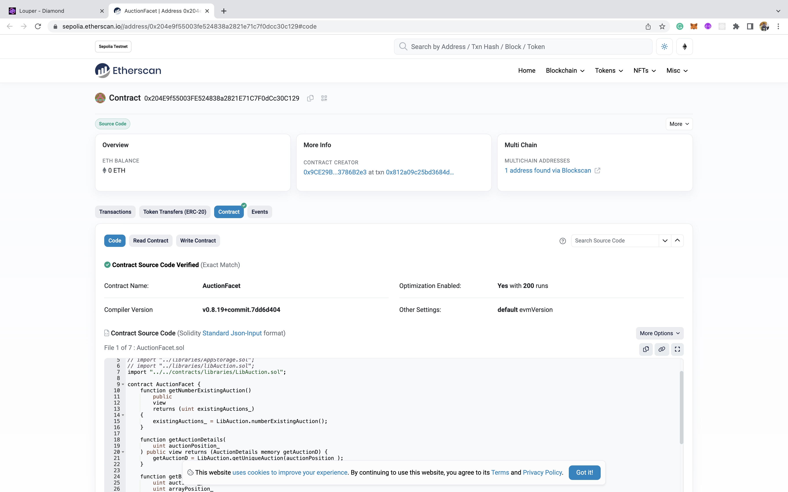
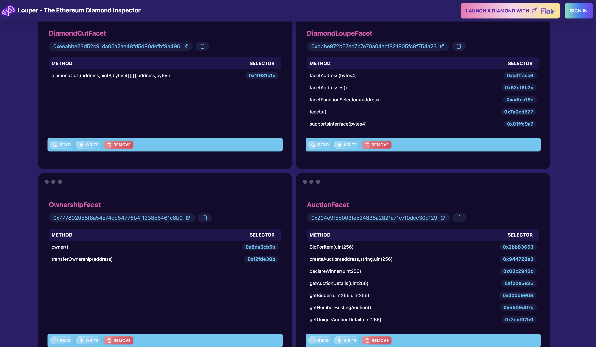

# Auction Contract EIP2535 Standard

## Smart Contract Project @ WEB3BRIDGE

### Contents

- Overview EIP2535
- Introduction to Auction
- Snippets
- Languages
- Functions

### Overview

Nick Mudge created the Diamond EIP in the Feb of 2020. By the Octoberof 2022, the proposal was finalized. The proposal standardizes diamonds, which are modular smart contract systems that can be upgraded/extended after deployment, and have virtually no size limit. In more clear terms, this means that you can add, remove or replace function in an already deployed contract. Its Structure is modularized into four parts;

- The diamond which is basically the facade, takes in the diamondcut address and contract owner address as constructor inputs during deployment. it holds the state variables and a fallback fuction to the facet contracts.
- The diamondcut; deployed first before the diamond and is used for the upgrades.
- The diamondLoupe; Holds all facet contract addresses and their corresponding functions
- The facets; stateless smart contracts that are deployed to blockchain and holds the functions that modifies the state of the diamond. The diamond Loupe and Ownership Facets fall under these.
- diamondInit: contains an init function=> called on first diamond upgrade to initialize state of some state variables. This is optional.

For more information on EIP2535 [Diamond Contracts](https://www.info.diamonds/).

### Introduction To Auction Contract

This contract is created to enable limitless auction listing by anyone. Anyone is allowed to list an auction item for contract users to bid. When the set duration time for auction elapses, bidding for specific auction is disabled. Those who lost bid will have their bids returned to their wallets while the contract holds the winners bid and transfers the auctioned Item in exchange. Only contract owner or Auction creator can declare winner. There is a charge on each auction creator at listing. The test files and script file can be found in their folders respectively. Use [Auction Contract](https://louper.dev/diamond/0xa0C729824fd77932C90b5898957AfFBb1A18C246?network=sepolia), to access contract via louper website.

### Snippets

#### Contract snippet

#### Test Code

#### Etherscan Verification

#### Louper.dev UI for contract

### Language

- Solidity

### Function Interactions

- BidForItem(uint256)
- createAuction(address,string,uint256)
- declareWinner(uint256)
- getAuctionDetails(uint256)
